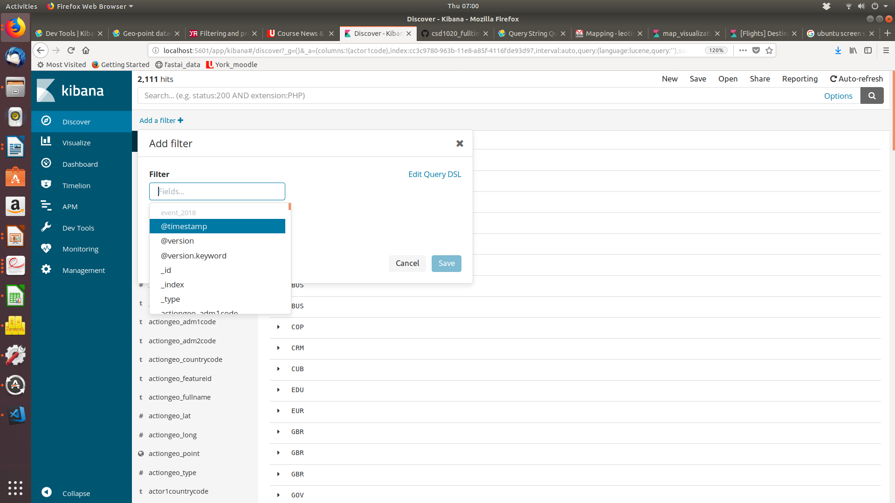

# Visualizing and Building Dashboards with Kibana


In todays lab you be learning how to: 

1. Analyse data using Kibana
2. Building dashboards

In this lab we will take a different approach from the one we have taken before. I will point you to application reference materials and you will use these materials to complete your tasks. It may seem difficult at first, but I will be here to guide you through the Journey. 

This is a very good skill to have. Since I have been using the elastic stack it undergone many upgrades. Last year it was at version 5 now it is at version 6.4. Learning to learn and use the reference material will help you keep current and protect the investment you made in this course. 


Task # 1

1. Visit the following site: https://demo.elastic.co
2. Review the dashboards. 
3. Create a map visualization. The following will tell you more about map visualization and creating visualizations: https://www.elastic.co/guide/en/kibana/current/createvis.html

4. In order to create the above visualization you will have to a geopoint object in your data see: https://www.elastic.co/guide/en/elasticsearch/reference/6.3/geo-point.html

Perform the following steps to create geo_point. 

1. In the kibana dev console: run the following query to create an index

  - PUT events

  - Then add a geopoint mapping like this: 

```json
PUT /events4/_mapping/doc
{
   "properties": {
    "actiongeo_point": {
      "type": "geo_point"
    }
  } 
}
```

**## Important must be done before ingesting the file**


2. In the logstash config assuming you want to create a geopoint for the:
   actiongeo_lat', 'actiongeo_long'  fields.You will need to add the following to the logstash config, to prepare your actiongeo_long and actiongeo_lat to be converted to a geo_point

```json
mutate {convert => ["actiongeo_long", "float"]}
mutate {convert => ["actiongeo_lat", "float"]}
mutate { add_field => ["[actiongeo_point][lon]","%{actiongeo_long}"]
        add_field => ["[actiongeo_point][lat]","%{actiongeo_lat}"]}
```

  

3. After you do this save the logstash config file and rerun the logstash -f    command with the updated config. After this is done you will now have a      geopoint field called actiongeo_point. This you will be able to visualize    on a map.


###  Using Query DSL to filter your data

You can filter your data to only your 5 countries by using the "add filter feature" shown in the image below. This function also allows you to add queries like the ones we explored in the previous lab exercise. However you will not be able to use aggregation queries. These you will have to configure using the UI. 

 "Using Filter function to filter your data"


